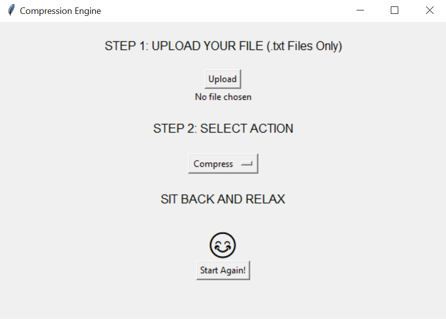

# Compression Engine



## Overview

Welcome to the Compression Engine, a user-friendly tool for file compression and decompression. This application features a dynamic user interface with CSS styling, emojis, and straightforward functionality to compress and decompress text files.

## Features

- 🌈 **Dynamic User Interface**: The application boasts a visually appealing UI with CSS styling for a modern look.

- ⬆️ **File Upload**: Easily upload text files for compression or decompression.

- 📜 **File Type Support**: Supported file types are limited to `.txt` files for simplicity.

- 🌟 **Emoji Fun**: Enjoy the use of emojis for a friendly and engaging experience.

- 📦 **Compression**: Choose the "Compress" action to compress your selected text file.

- 📤 **Decompression**: Choose the "Decompress" action to decompress your compressed text file.

## How to Use

1. **Upload Your File**:

   - Click the "Upload" button to select a `.txt` file for compression or decompression.
   - The selected file will be displayed on the screen.

2. **Select Action**:

   - Use the dropdown menu to choose between "Compress" and "Decompress."

3. **Start the Process**:
   - Click the "Start" button to initiate the chosen action.
   - If you wish to start over, click the "Start Again!" button.

## Requirements

- Python 3.7+
- Tkinter library (usually included in standard Python installations)

## Installation

1. Clone the repository:

   ```shell
   git clone https://github.com/your-username/compression-engine.git
   ```

2. Navigate to the project directory:

   ```shell
   cd compression-engine
   ```

3. Run the application:

   ```shell
   python your_app.py
   ```

## Contributors

- Anuj Trivedi (@aasn0119)

Enjoy compressing and decompressing your text files with the Compression Engine! 😊
